  <picture>
    <source media="(prefers-color-scheme: dark)"
      srcset="profile-header-dark.svg">

    <source media="(prefers-color-scheme: light)"
      srcset="profile-header-light.svg">

    
  </picture>

 

  

